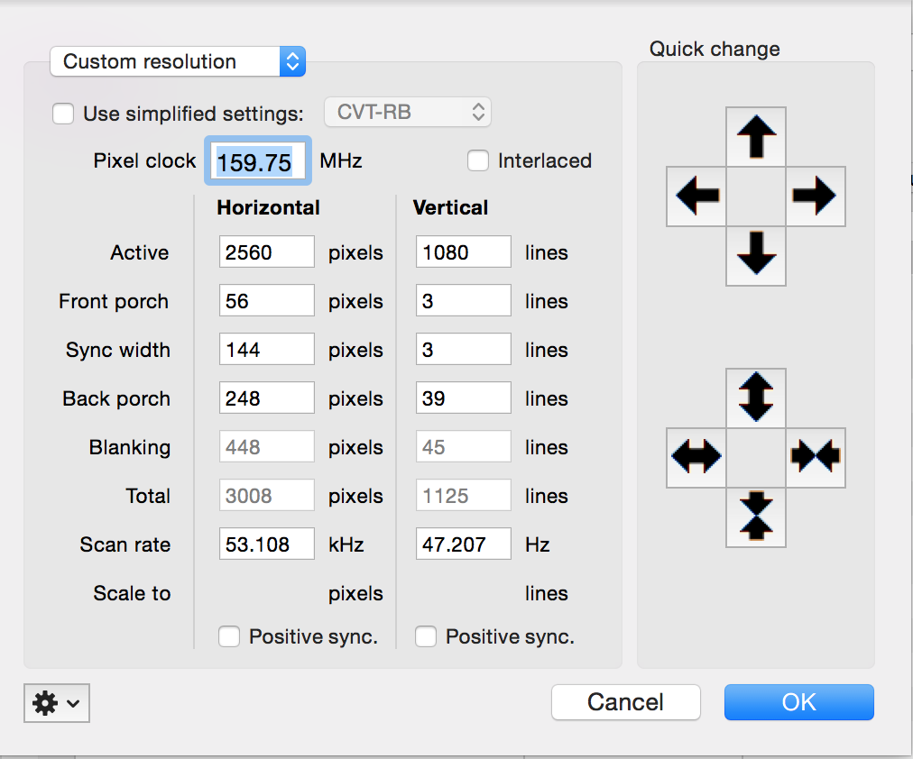

# SwitchResX

Para os Macbook's Pro que não tem suporte a resoluções maiores, por exemplo 2560x1080, existe um programa chamado `SwitchResX` que ajuda o MacOS há da suporte a essas resoluções "não suportadas".

Vamos aos passos desse "milagre".

**Pré-requisitos**

Para utilizar o `SwitchResX` você deverá desabilitar um proteção do sistema.

Para isso você deve verificar se já está desabilitada executando o comando: 

```sh
$ csrutil status
System Integrity Protection status: disabled.
```

Caso esteja habilitada siga os passos aqui: [How to Disable System Integrity Protection (rootless) in Mac OS X](http://osxdaily.com/2015/10/05/disable-rootless-system-integrity-protection-mac-os-x/)

**1.** Crie um novo usuário:

`System Preferences` > `Users & Groups` > `Click the lock to make changes` > `+`

Preencha o formulário:

- Full Name: switchresx
- Account Name: switchresx
- Password: switchresx

Depois clique no botão `Create User`.

**2.** Logue com o usuário que foi criado.

**3.** Instale o programa `SwitchResX`, faça o [download aqui](http://www.madrau.com/data/switchresx/SwitchResX4.zip).

**4.** Configure a nova resolução para seu monitor:

`System Preferences` > `SwitchResX`

- Clique no botão `Install helper tools...`, selecione todas as opções e clique em `OK`.
- Clique no botão `Launch Daemon`.

Agora vamos criar a nova resolução: 

- No Menu lateral esquerdo selecione selecione o seu monitor, no meu caso `LG ULTRAWIDE (2)`
- Na aba `Current Resolutions` escolha a resolução 1080p que funcione corretamente sem ficar "tremendo" a tela, no meu caso `1080p50 (PAL)`
- Clique no botão logo abaixo da lista que parece um "olho"
- Clique na `engrenagem` > `Copy Resolution to Powerstrip/Modeline`, `OK`
- Na aba `Custom Resolutions`, Botão `+`
- Selecione `Custom resolution`
- Ajuste a resolução para ficar com a resolução do seu monitor, no meu caso `2560x1080`, depois clique em `OK`
- Selecione a sua nova resolução,
- Depois `command + S` e reinicie o seu Macbook

**5.** Utilizando a nova resolução

Após o macbook reiniciar você pode logar com seu usuário normalmente, ir em `System Preferences` > `Displays`, procurar o seu monitor e selecionar a nova resolução para ele.

Você também já poderá excluir o usuário `switchresx` se tudo tiver dado certo.

PS: Lembre-se, caso venha a fazer uma atualização de MacOS grande, ou seja, como atualização de versão major, você terá que refazer esses passos, criando um novo usuário e etc.

---

# Fixing switchResx saving issue

  PS: you should perform before continue (rootless):  http://osxdaily.com/2015/10/05/disable-rootless-system-integrity-protection-mac-os-x/

Recently I bought a ultra-wide monitor which a really weird but useful 21:9 aspect ratio.The only way mac would support this if i get a mini displayport to displayport adapter.

Since some orders take weeks for souq to fullfil.I decided to the use the single DVI cable from my older monitor on the new one.Once I plugged it in I faced the same issue the mac would only render only upto Full HD or 1920 X 1080.After a quick googling I found that SwitchResX can solve this issue.

But for some reason every time I create a custom resolution of 2560 X 1080,SwitchResX would not save it and if it did it would say not installed.I tried this a couple of times.I even deleted all the SwitchResX files and even uninstall SwitchResX from the menu bar.

Even setting the resolution was really  difficult, after rebooting a couple of times I finally got it working with the following settings.



To get SwitchResX to save the settings.Follow the instructions in these instructions:

- Create a new user on the mac
- Install the SwitchResX application,this will start the 10 days trial.
- Create the resolution profile and save it.
- It should prompt you to reboot the mac.Please do so.

And Voila the resolution is should now present on your original user’s SwitchResX.Now you can select it in the current resolution tab.

by: http://surajms.com/2015/04/fixing-switchresx-saving-issue/
